

  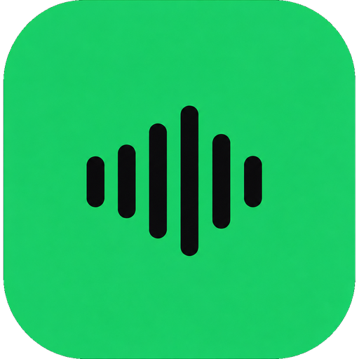

<h1 align="center">Resonus</h1>

  A clean music player for your self-hosted server, and your local files.
   
  Android, with an experimental iOS build.

---

  
  
  
  
   
  
  

## Screenshots

| Home | Player | Album | Library |
| :---: | :---: | :---: | :---: |
| 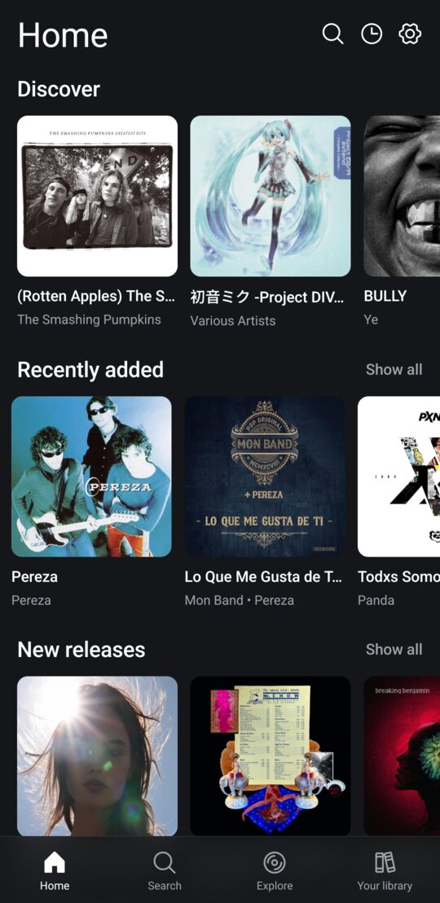 | 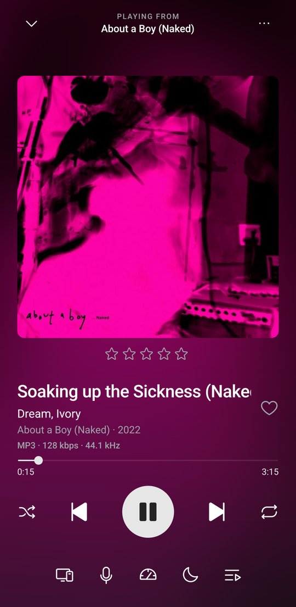 | 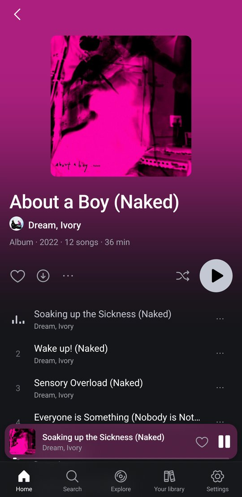 | 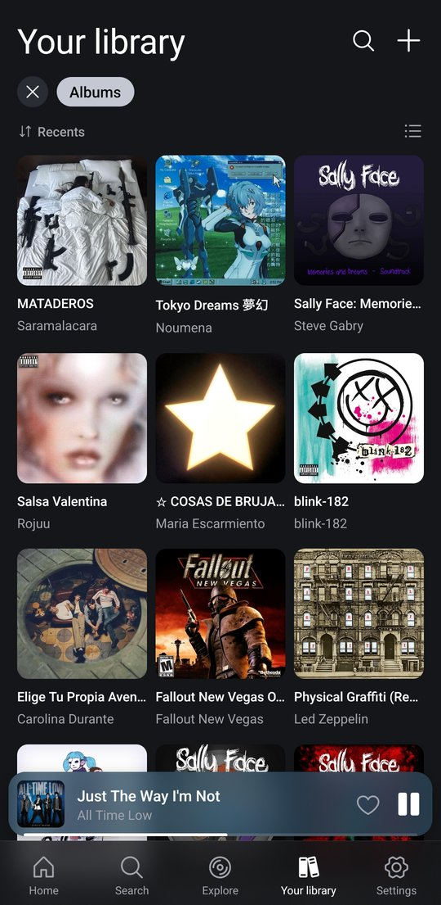 |
| 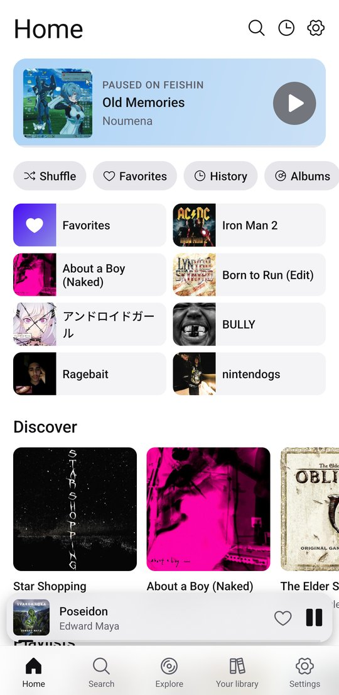 | 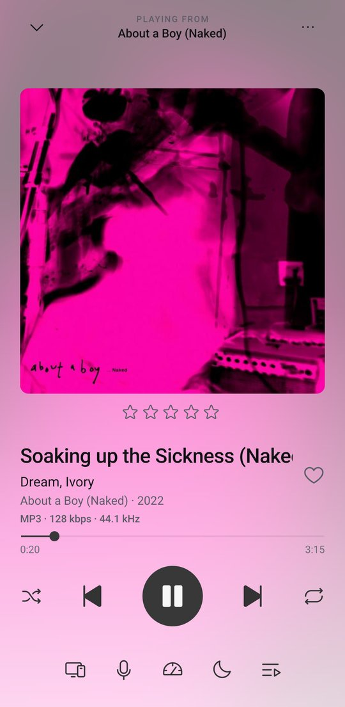 | 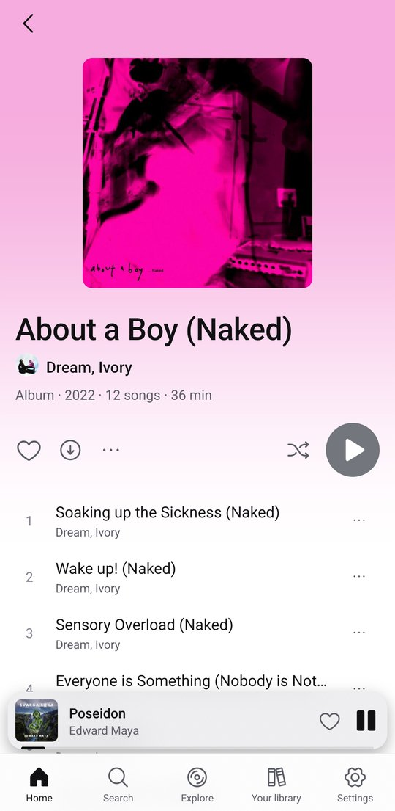 | 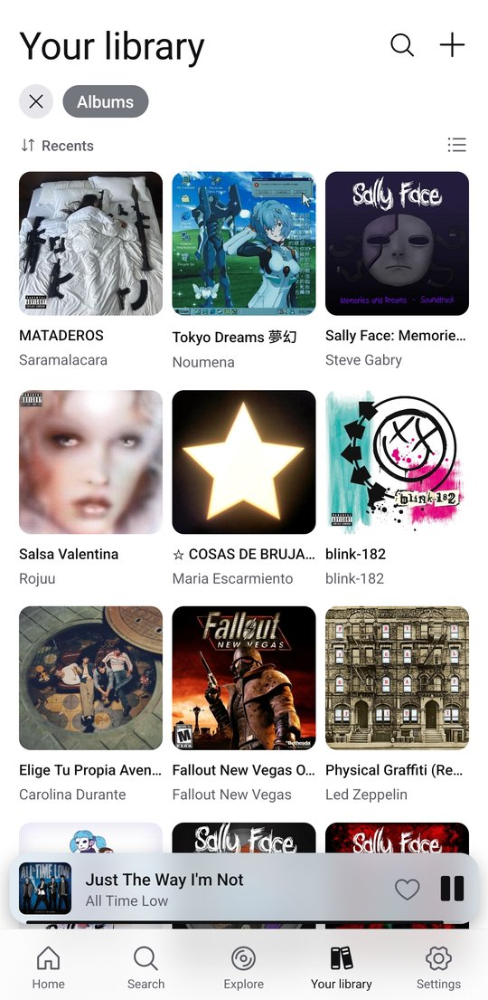 |

| Artist | Lyrics | Queue | Servers |
| :---: | :---: | :---: | :---: |
| 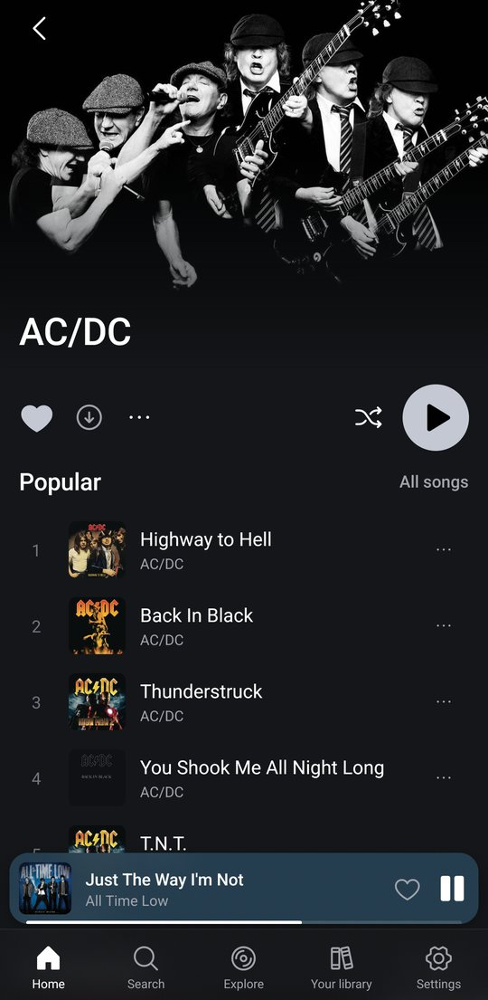 | 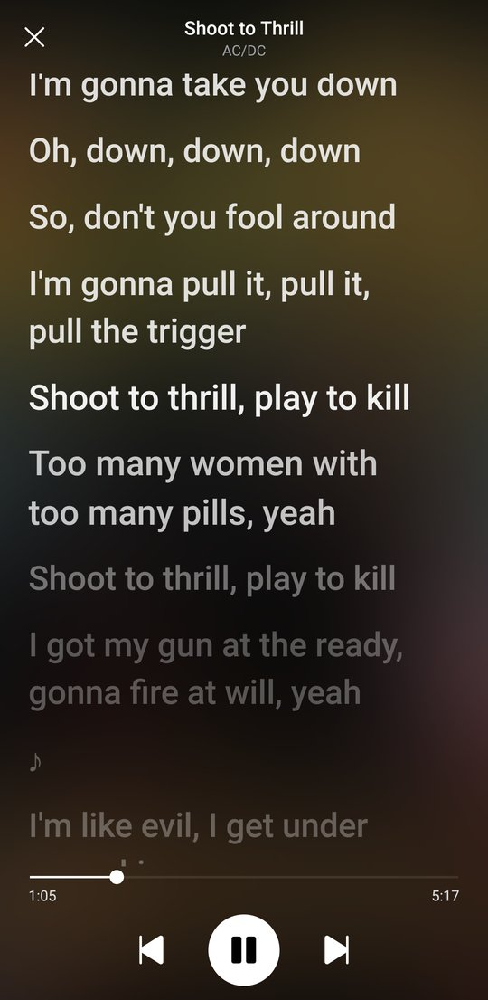 | 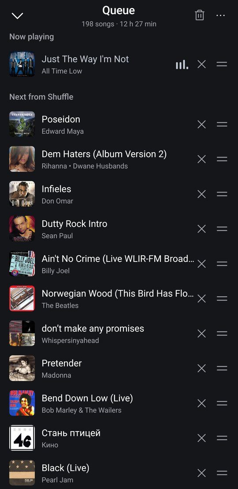 | 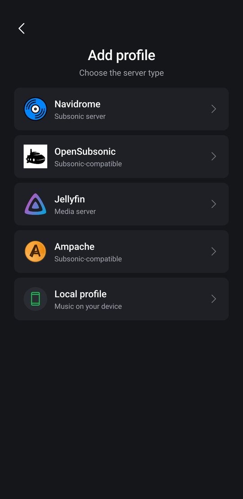 |

## Download

### Android

Get the latest APK from the [Releases](https://github.com/juananzzz/resonus/releases/latest) page and install it on your Android device.

Also available on [Obtainium](https://apps.obtainium.imranr.dev/redirect?r=obtainium://add/https://github.com/juananzzz/resonus) for automatic updates.

### iOS (experimental)

Download the `.ipa` from the [Releases](https://github.com/juananzzz/resonus/releases/latest)
page and sideload it with AltStore, Sideloadly or similar, or
[add Resonus as an AltSource](https://altdirect.app/?url=https://raw.githubusercontent.com/juananzzz/resonus/main/Source.json)
to get updates. The build is unsigned, so it is not on the App Store or TestFlight.

Not available on iOS yet: CarPlay, casting, the equalizer and gapless playback.

## Features

- **Navidrome / OpenSubsonic / Jellyfin / Ampache**: multi-profile login, multi-library support, plus several server addresses with automatic switching
- **Local mode**: play music straight from your device or a folder, no server needed
- **Offline mode**: your favorites, playlists and albums stay browsable with no connection; downloaded songs play, the rest show grayed out, and it switches automatically when the server is unreachable
- **Downloads**: albums, playlists, an artist's whole discography or single songs, in original quality or transcoded
- **Synced lyrics**: karaoke view with tap-to-seek, word-by-word highlighting (TTML and enhanced LRC), full-screen mode, optional LRCLIB lookup
- **Internet radio**: browse and manage your stations
- **Cast to speakers**: UPnP/DLNA renderers and Sonos, with room grouping; local music streams to them too
- **Playback**: gapless, crossfade, built-in equalizer, ReplayGain normalization, playback speed, sleep timer, queue with undo, shuffle, repeat, background & lock-screen controls
- **Autoplay & mixes**: keep the music going with similar songs, or start a mix from any track
- **Organize**: multi-select (queue, playlist or download in batch), star ratings, pinned items, play history
- **Themes**: dark, light, the phone's own or on a schedule, with a palette of accent colors or one of your own
- **Make it yours**: reorder and show/hide Home sections, chips and tabs, app fonts, lyrics size, mini player buttons, swipe actions and more
- **Android Auto** (experimental)
- **Landscape and tablet layouts**
- **Queue sync across devices**
- **In 10 languages**: English, Spanish, German, Catalan, Russian, Italian, Simplified Chinese, Ukrainian, Polish, Swedish

## FAQ

The questions that come up most often are answered in
[docs/FAQ.md](./docs/FAQ.md), starting with how to get Resonus to show up in
Android Auto. The app links to it too, from Settings › About.

## Translations

More languages are welcome via pull request. See
[TRANSLATING.md](./TRANSLATING.md) for how to add one, plus context for the
trickier strings.

## Community

Join the [Discord server](https://discord.gg/pecE8MTPVr) to share feedback,
report bugs, ask questions, or just follow along with development.

## Contributing

Contributions are welcome. See [CONTRIBUTING.md](./CONTRIBUTING.md) for how to
set up the project, run it on an emulator, and open a pull request.

## Support

Resonus is free and open source, built in my spare time. If you enjoy it and
want to help me keep working on it, you can buy me a coffee on
[Ko-fi](https://ko-fi.com/juananzzz).
